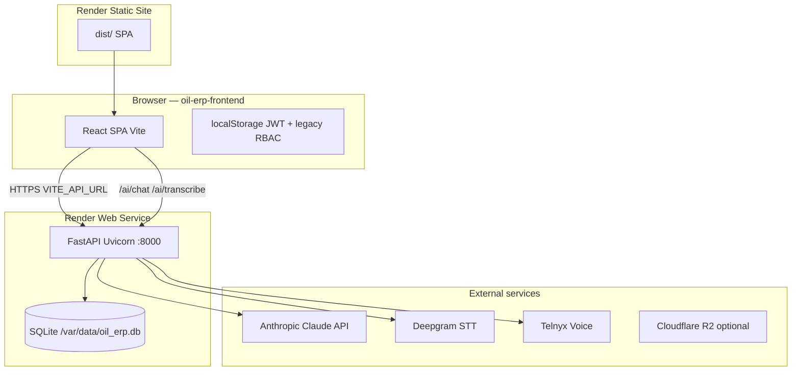

# SOLTOL ONE ERP — Software Map

> **Repo:** `oil-erp-frontend` (`https://github.com/maxwaxbahrain/oil-erp-frontend-.git`)  
> **Companion backend:** `oil-erp-backend` (FastAPI, **not in this repo** — documented from read-only inspection at `/Users/abdulqadeer/Desktop/desktop/oil-erp-backend`)  
> **Generated:** read-only reverse documentation. Every major claim cites source paths.

---

## Sources read (by section)

| Section | Primary files / areas |
|---------|----------------------|
| 1 Architecture | `package.json`, `vite.config.ts`, `render.yaml`, `render.staging.yaml`, `.env.example`, `src/main.tsx`, `src/app/App.tsx`, `START_PYTHON_BACKEND.md`, `PROJECT_SOURCE_OF_TRUTH.md`, backend `app/main.py`, `render.yaml` |
| 2 Structure | Full `src/` tree, `src/app/routes.tsx` |
| 3 Data models | Backend `app/models/*`, `app/filing/models/*`, `app/voice/models/*`, `app/database.py` |
| 4 API | Backend `app/api/*`, frontend `src/services/*.ts`, `src/api/axios.ts`, page-level fetch calls |
| 5 Auth / tenancy | `src/contexts/AuthContext.tsx`, `src/store/authStore.ts`, `src/components/ProtectedRoute.tsx`, backend `app/core/security.py`, `app/core/dependencies.py`, `app/core/tenant_middleware.py` |
| 6 Roles | `AuthContext.tsx`, `authStore.ts` (`MODULE_ACCESS`), `Sidebar.tsx`, `routes.tsx`, `App.tsx` (role pill) |
| 7 Pages | `src/app/routes.tsx`, all `src/pages/**` |
| 8 Components / state | `src/main.tsx`, `src/api/axios.ts`, `src/config/apiBase.ts`, `src/components/**` |
| 9 Business rules | `src/services/*`, `src/utils/*`, `src/pages/Sales/InvoiceFormPage.tsx` |
| 10 AI | `src/components/VoiceAssistant/*`, `src/services/voiceAssistantService.ts`, `src/components/AIAssistant.tsx`, backend `app/api/ai.py`, `app/api/transcribe.py` |
| 11 Integrations | `.env.example`, `render.yaml`, `voiceService.ts`, backend `app/config.py` |
| 12 Jobs | Backend `app/main.py`, `app/api/integrations.py` |
| 13 Gaps | Grep `TODO`/`FIXME` in `src/`, backend exploration notes |
| 14 Open questions | Items not verifiable from frontend repo alone |

---

## 1. High-level architecture

### 1.1 System diagram



### 1.2 Verified stack

| Layer | Stated context | Verified in repo |
|-------|----------------|------------------|
| Frontend | React + TS + Vite 7 + Tailwind 4 + React Router 7 + Axios + Recharts + Lucide | **Confirmed** — `package.json` |
| Backend | FastAPI + SQLAlchemy + SQLite + Pydantic v2 + Uvicorn | **Confirmed** in companion backend `requirements.txt`, `render.yaml` |
| Multi-tenant JWT | Yes | **Partial** — SaaS `saas_tenants` + `users.tenant_id`; most ERP tables **lack** `tenant_id` (backend finding) |

### 1.3 Request lifecycle (typical authenticated action)

Example: user saves an invoice.

1. **UI** — `src/pages/Sales/InvoiceFormPage.tsx` validates lines (qty/rate > 0, grandTotal > 0) and computes totals client-side.
2. **Service** — `src/services/api.ts` `createInvoice()` / `updateInvoice()` → `fetch` to `{VITE_API_URL}/api/invoices/` with `Authorization: Bearer {access_token}` from `localStorage` (`ACCESS_TOKEN_KEY` in `src/api/axios.ts`).
3. **Dev proxy** — Vite proxies `/api` → `VITE_API_URL` (`vite.config.ts` port **5174**).
4. **Backend** — FastAPI route in backend `app/api/invoices.py` persists to SQLite via SQLAlchemy session (`app/database.py`).
5. **Response** — JSON invoice row returned; UI refreshes lists / navigates.

**401 path:** Axios interceptor in `src/api/axios.ts` clears token + redirects to `/login`. Fetch-based services may not all handle 401 uniformly.

### 1.4 Local development

| Service | Command | Port | Source |
|---------|---------|------|--------|
| Frontend | `npm run dev` | 5174 | `vite.config.ts` |
| Backend | `uvicorn app.main:app --reload --port 8000` | 8000 | `START_PYTHON_BACKEND.md`, `PROJECT_SOURCE_OF_TRUTH.md` |

Backend path (canonical per `PROJECT_SOURCE_OF_TRUTH.md`): `/Users/abdulqadeer/Desktop/desktop/oil-erp-backend`.

### 1.5 Production / Render deployment

**Frontend** (`render.yaml`):

- Type: **static site** (`soltol-frontend-production`)
- Build: `npm install && npm run build`
- Publish: `./dist`
- SPA rewrite: `/* → /index.html`; also copies `index.html` → `200.html` in build script
- Env: `VITE_API_URL=https://bettano-erp-backend.onrender.com`, `VITE_APP_URL=https://www.soltol.com`

**Staging** (`render.staging.yaml`): backend `bettano-erp-backend-staging`, frontend `app.soltol.com`.

**Backend** (companion repo `render.yaml`):

- Python 3.11 web service `bettano-erp-backend`
- Start: `uvicorn app.main:app --host 0.0.0.0 --port $PORT`
- Persistent disk: `/var/data` → `DATABASE_URL=sqlite:////var/data/oil_erp.db`

---

## 2. Repo / file structure

### 2.1 Frontend (`oil-erp-frontend`)

```
oil-erp-frontend/
├── src/
│   ├── main.tsx              # React root, AuthProvider, ErrorBoundary, BrowserRouter
│   ├── app/
│   │   ├── App.tsx           # Shell: sidebar, header, tabs, AI assistant, advisor dock
│   │   └── routes.tsx        # All React Router routes (~158 definitions)
│   ├── api/axios.ts          # Axios instance + JWT interceptors
│   ├── config/apiBase.ts     # getOilErpApiBase() for fetch services
│   ├── contexts/AuthContext.tsx
│   ├── store/authStore.ts    # Legacy MODULE_ACCESS + role mapping
│   ├── components/           # Shared UI (layout, voice, AI, forms, advisor dock)
│   ├── pages/                # Feature pages (~28 module folders, ~186 files)
│   ├── services/             # API clients + business logic (~30 service modules)
│   ├── hooks/                # useMicInput, useTracking, useDeepgramRecognition, etc.
│   ├── utils/                # arMetrics, salesMetrics, PDF helpers
│   ├── constants/            # currencies, advisor URL, data seeds
│   ├── styles/               # theme.css (Redwood design tokens)
│   └── types/                # Shared TS types
├── public/                   # Static assets
├── render.yaml               # Render static deploy (production)
├── render.staging.yaml
├── vite.config.ts
├── package.json
└── docs/SOFTWARE_MAP.md      # This file
```

### 2.2 Backend (`oil-erp-backend` — separate repo)

```
oil-erp-backend/
├── app/
│   ├── main.py               # FastAPI app, router mounts, startup hooks
│   ├── database.py           # SQLAlchemy engine + SessionLocal
│   ├── config.py             # Settings / env vars
│   ├── core/                 # security.py, dependencies.py, tenant_middleware.py
│   ├── models/               # ERP + tax SQLAlchemy models
│   ├── api/                  # REST routers (customers, invoices, ai, …)
│   ├── filing/               # Tax filing AI subsystem
│   └── voice/                # Telnyx/Deepgram voice subsystem
├── requirements.txt
├── render.yaml
└── oil_erp.db                # Local SQLite (production uses /var/data/)
```

---

## 3. Data models & database

**Database:** SQLite (local `oil_erp.db`; production `sqlite:////var/data/oil_erp.db` per backend `render.yaml`).

**ORM:** SQLAlchemy 2.x models in backend `app/models/`. No models in the frontend repo.

### 3.1 Tenant scoping (critical)

| Scope | Tables / mechanism | Source |
|-------|-------------------|--------|
| SaaS billing | `saas_tenants`, `users.tenant_id`, `ai_usage.tenant_id` | backend models |
| Voice product | Separate `tenants` table (UUID), `calls.tenant_id`, etc. | backend `app/voice/models/` |
| **Core ERP** | Customers, products, invoices, etc. — **no `tenant_id` column** | backend exploration |

**Implication:** ERP business data is effectively **shared in one SQLite file** per deployment; SaaS tenant isolation is incomplete for operational data.

### 3.2 Core ERP models (summary)

Full field lists verified in backend `app/models/`. Key entities:

| Model | Table | Purpose | Key relationships |
|-------|-------|---------|-------------------|
| User | `users` | Login accounts | `tenant_id` → SaasTenant |
| SaasTenant | `saas_tenants` | Trial/plan, AI token counters | Has many Users |
| Customer | `customers` | AR customers | Invoices, payments, ledger |
| Product | `products` | Catalog + stock | PO lines, invoice lines (JSON) |
| Invoice | `invoices` | Sales invoices | `customer_id`, `items` JSON, `share_token` |
| Payment | `payments` | Customer receipts | `customer_id`, optional `invoice_id` |
| SalesOrder | `sales_orders` | Orders / van sales | UUID id, `van_id`, POD flags |
| Van / VanLoad / VanClosing | `vans`, `van_loads`, `van_closings` | Fleet & loads | |
| DeliveryNote / POD | `delivery_notes`, `pods` | Logistics proof | |
| Supplier / PO | `suppliers`, `purchase_orders`, `purchase_order_items` | Procurement | |
| SalesReturn / CreditNote | `sales_returns`, `credit_notes` | Returns & credits | |
| Expense | `expenses` | OpEx + AI receipt fields | |
| JournalVoucher | `journal_vouchers`, `journal_voucher_lines` | GL entries | |
| BankTransaction / PDC | `bank_transactions`, `post_dated_cheques` | Banking | |
| RouteCustomer | `route_customers` | Delivery route stops | |
| TaxRule / TaxTransaction / … | `tax_*` tables | US sales tax engine | |
| TaxFiling / FilingRecord | `tax_filings`, … | IRS filing wizard | |
| AIUsage | `ai_usage` | Per-tenant AI metering | |

### 3.3 Invoice / line item shape (inferred)

Invoice line items stored as **JSON** on `invoices.items` (backend model). Frontend maps `quantity`, `rate`, `amount`, product name/id in `InvoiceFormPage.tsx`.

---

## 4. API endpoints

Endpoints exist on the **backend**. The frontend calls a subset. Below: backend routes (authoritative) + frontend usage notes.

### 4.1 Auth & tenants

| Method | Path | Auth (backend) | Frontend caller |
|--------|------|----------------|-----------------|
| POST | `/api/auth/login` | Public | `AuthContext.tsx` |
| GET | `/api/auth/me` | JWT | `AuthContext.tsx` |
| POST | `/api/auth/change-password` | JWT | `ChangePassword.tsx` |
| GET/POST/PATCH/DELETE | `/api/auth/users` | JWT admin | `UserManagement.tsx` |
| POST | `/api/tenants/register` | Public | `SignupPage.tsx` |
| GET | `/api/tenants/me` | JWT | `BillingPage.tsx`, `App.tsx` |

### 4.2 Superadmin

| Method | Path | Auth | Frontend |
|--------|------|------|----------|
| GET | `/api/superadmin/overview`, `/tenants`, `/ai-usage`, `/page-activity` | Super admin (`username == "admin"`) | `SuperAdminPage.tsx` |
| POST | `/api/superadmin/tenants/{id}/activate\|deactivate` | Super admin | `SuperAdminPage.tsx` |

### 4.3 Core ERP (representative — most lack JWT on backend)

| Resource | Base path | Methods | Frontend service |
|----------|-----------|---------|------------------|
| Customers | `/api/customers/` | CRUD, ledger, payments, overdue, search, bulk clear | `api.ts`, `customerService.ts` |
| Products | `/api/products/` | CRUD, `PATCH …/add-stock` | `api.ts`, `productService.ts`, `grnService.ts` |
| Invoices | `/api/invoices/` | CRUD; public `GET /view/{token}` | `api.ts`, `invoiceDocumentService.ts` |
| Payments / ledger | `/api/ledger/payment`, `/api/payments` | POST/PUT | `api.ts`, `PaymentEdit.tsx` |
| Sales orders | `/api/sales-orders` | CRUD, convert-to-invoice | `salesService.ts` |
| Sales returns | `/api/sales-returns/` | CRUD | `salesReturnService.ts` |
| Credit notes | `/api/credit-notes/` | CRUD | `creditNoteService.ts` |
| Suppliers / POs | `/api/suppliers/`, `/api/purchase-orders/` | CRUD | `purchasesService.ts` |
| Vans / loads | `/api/vans`, `/api/van-loads` | CRUD | `api.ts`, `VanOperations.tsx` |
| Delivery notes | `/api/delivery-notes` | CRUD | `deliveryService.ts` |
| Routes | `/api/routes/` | CRUD stops | `routeService.ts` |
| Expenses | `/api/expenses/` | CRUD | `expenseService.ts` |
| Journal vouchers | `/api/journal-vouchers/` | CRUD | `JournalVoucher.tsx` |
| Banking / PDC | `/api/bank-transactions/`, `/api/pdc/` | CRUD | `Banking.tsx` |
| GL reports | `/api/gl/*`, `/api/accounts/` | GET | `glService.ts` |
| Migration | `/api/migrate/full-import`, `clear-all` | POST/DELETE | `DataMigration.tsx` |

**Security note (backend):** Most ERP CRUD routes use only `Depends(get_db)` — **no JWT required server-side**. Frontend still sends Bearer token when available.

### 4.4 Tax

| Base | Frontend |
|------|----------|
| `/api/tax-engine/*` | `TaxEngine.tsx`, `taxEngineApi.ts` |
| `/api/v1/tax/*` | Tax transactions UI |
| `/api/v2/filing/*` | `filingApi.ts`, Filing wizard pages |

### 4.5 AI

| Method | Path | Auth | Frontend |
|--------|------|------|----------|
| POST | `/ai/chat`, `/api/ai/chat` | Optional trial check if Bearer | Voice, AIAssistant, agents, expenses |
| POST | `/ai/transcribe` | Optional trial | `useDeepgramRecognition.ts` |
| POST | `/api/ai/tax-advisor/stream` | Optional trial | `TaxAdvisor.tsx` (SSE) |
| POST | `/api/ai/meeting/process` | None | `useMeetingRecorder.ts` |
| POST | `/ai/news`, `/ai/credit/search` | Optional trial | News, Credit pages |

### 4.6 Voice (separate tenant API key)

Base `/api/voice/*` — auth header `X-Tenant-Api-Key`. See `src/services/voiceService.ts`.

### 4.7 Unmounted backend routes

`app/api/reports.py` defines daily/weekly report endpoints but is **not included** in `app/main.py` — inactive.

---

## 5. Auth & multi-tenancy

### 5.1 Frontend JWT flow

| Step | Implementation |
|------|----------------|
| Login | `POST /api/auth/login` → store `access_token` + user in `localStorage` | `AuthContext.tsx` |
| Session restore | `GET /api/auth/me` on mount | `AuthContext.tsx` |
| Attach token | Axios request interceptor | `src/api/axios.ts` |
| Logout | Clear keys, redirect `/login` | `AuthContext.tsx` |
| Roles in JWT | `admin \| manager \| accountant \| driver \| sales` | `AuthContext.tsx` |

Legacy bridge: `syncAuthUser()` maps JWT roles → sidebar roles (`admin`→`owner`, `sales`→`salesman`, etc.) in `src/store/authStore.ts`.

### 5.2 Frontend route protection

- Outer wrapper: `<ProtectedRoute>` in `routes.tsx` — requires authentication.
- Nested `<ProtectedRoute roles={['admin']}>` on 17 admin routes (settings, users, superadmin, billing).
- **Sidebar** hides nav sections by `hasRole()` — `Sidebar.tsx`.
- **Role pill** in `App.tsx` is cosmetic navigation only — **not security**.

### 5.3 Backend auth (companion repo)

| Mechanism | Location | Behavior |
|-----------|----------|----------|
| JWT issue/validate | `app/core/security.py` | HS256, `sub`=user id, `role` claim |
| User load | `app/core/dependencies.py` | `get_current_user`, `require_admin`, etc. |
| SaaS trial gate | `app/core/tenant_middleware.py` | 402/403 if trial expired or tenant inactive |
| Voice tenant | `app/voice/middleware/tenant_auth.py` | API key hash |

### 5.4 Tenant isolation enforcement

- **Where enforced:** User registration attaches `tenant_id`; AI usage logged per tenant; trial middleware on AI routes.
- **Where NOT enforced:** ERP queries (customers, invoices, …) — no `tenant_id` filter in models.
- **Enforcement location:** Should be backend DB layer — **currently incomplete** for ERP tables.

---

## 6. Roles & permissions matrix

### 6.1 Backend JWT roles (`AuthContext.tsx`)

`admin`, `manager`, `accountant`, `driver`, `sales`

### 6.2 Legacy module roles (`authStore.ts` → `MODULE_ACCESS`)

Legacy roles: `owner`, `manager`, `sales_manager`, `salesman`, `accountant`, `van_driver`, `marketing`, `warehouse`.

Mapping (`mapBackendRole`):

| JWT role | Legacy role |
|----------|-------------|
| admin | owner |
| manager | manager |
| accountant | accountant |
| driver | van_driver |
| sales | salesman |

### 6.3 UI persona pill (`App.tsx`) — cosmetic only

System Admin, Accountant, Sales Manager, Warehouse, Van Driver, AI Hub → dashboard routes.

### 6.4 Access matrix (effective UX)

| Capability | admin | manager | accountant | sales | driver |
|------------|:-----:|:-------:|:----------:|:-----:|:------:|
| Route: admin settings/users/superadmin | ✓ | | | | |
| Sidebar: Sales | ✓ | ✓ | | ✓ | |
| Sidebar: Finance | ✓ | | ✓ | | |
| Sidebar: Inventory | ✓ | ✓ | | | |
| Sidebar: Logistics/POD | ✓ | ✓ | | | ✓ |
| Sidebar: AI/Agents/News (ungated) | ✓ | ✓ | ✓ | ✓ | ✓ |
| API ERP CRUD (backend) | **open** | **open** | **open** | **open** | **open** |

**Gap:** Sidebar gating ≠ API authorization. Non-admin users can call most ERP APIs if they know URLs.

---

## 7. Frontend pages & features

**Scale:** ~**158** route definitions, **~170** page components, **28** page module folders (`src/pages/`). The “~27 pages” in product docs refers to major module dashboards, not total routes.

### 7.1 Module dashboards (role entry points)

| Route | Component | Module |
|-------|-----------|--------|
| `/dashboard` | `Dashboard/Dashboard.tsx` | System overview |
| `/finance/dashboard` | `Finance/FinanceDashboard.tsx` | Finance |
| `/sales/dashboard` | `Sales/SalesDashboard.tsx` | Sales |
| `/warehouse/dashboard` | `Warehouse/WarehouseDashboard.tsx` | Warehouse |
| `/van/dashboard` | `VanDriver/VanDriverDashboard.tsx` | Van driver |
| `/ai/hub` | `AIHub/AIHubDashboard.tsx` | AI Hub |

### 7.2 Major modules (routed pages)

| Module | Key routes | Primary APIs | Notable actions |
|--------|------------|--------------|-----------------|
| **Sales** | `/sales/*`, invoices, orders, returns, credit notes | `/api/invoices`, `/api/sales-orders`, returns, credit-notes | Create invoice, convert SO→invoice, analytics |
| **Customers** | `/customers/*` | `/api/customers/` | CRUD, ledger, GPS |
| **Inventory** | `/products/*`, `/inventory/*`, `/receiving/*` | `/api/products/`, add-stock | GRN, transfers, AI stock control |
| **Procurement** | `/purchases/*`, `/suppliers/*` | suppliers, purchase-orders | PO workflow, GRN confirm |
| **Finance** | `/finance/*` | expenses, GL, journal, banking | Expense AI upload, JV, opening balances |
| **Reports** | `/reports/*` | GL + client-side P&amp;L services | Aged AR/AP, trial balance, profitability |
| **Tax** | `/tax/*` | tax-engine, v1 tax, v2 filing | Calculator, filing wizard, tax advisor stream |
| **Logistics/POD** | `/logistics/*`, `/pod/*` | delivery-notes, vans | Driver app, fleet map, signatures |
| **Van sales** | `/van-sales/*` | Mixed: API + **localStorage** | Receipt print, local stock decrement |
| **AI** | `/ai/*`, `/agents/*` | `/ai/chat` | Forecasts, anomaly, auto-PO, agents |
| **Voice (telephony)** | `/voice/*` | `/api/voice/*` + WebSocket | Call history, coaching rules |
| **Marketing** | `/marketing/*` | `/ai/chat` for content | Campaigns, segments |
| **Pulse** | `/pulse/*` | `/ai/chat`, meeting process | Team chat, meeting notes |
| **Admin** | `/settings/*`, `/users/*`, `/superadmin/*` | auth users, superadmin | User CRUD, tenant billing |
| **Public** | `/`, `/login`, `/signup`, `/invoice/:token` | public invoice view | Share links |

### 7.3 Placeholder routes (not implemented)

`/sales/estimates`, `/sales/delivery-notes`, `/sales/receipts`, `/sales/payments` → `PlaceholderPage` in `routes.tsx`.

### 7.4 Pages without routes (dead/orphan)

Examples: `EmailRemindersPage.tsx`, `Customers/CustomerLedger.tsx`, `Inventory/InventoryDashboard.tsx`, `PreviewTheme/SoltolThemePreview.tsx` (shell bypass in `App.tsx` only).

### 7.5 Key shared components per area

| Area | Components |
|------|------------|
| Layout | `Sidebar.tsx`, `App.tsx` shell |
| Forms | `CustomerSelect`, `ProductSelect`, `FormInput`, `SearchableSelect` |
| AI/Voice | `CommandBar`, `VoiceAssistant`, `AIAssistant`, `AdvisorDock` |
| Tables | `DataTable.tsx` |
| Guards | `ProtectedRoute`, `AccountingSetupRequired` |

---

## 8. Shared components & state

### 8.1 Global state

| Concern | Mechanism | File |
|---------|-----------|------|
| Auth session | React Context | `contexts/AuthContext.tsx` |
| Legacy RBAC / module access | localStorage + helpers | `store/authStore.ts` |
| Theme | `body.light` class + localStorage `soltol-theme` | `App.tsx` |
| Voice language | localStorage `soltol_voice_lang` | `voiceLanguages.ts` |
| Advisor panel layout | localStorage width/side | `constants/advisor.ts` |

No Redux/Zustand — local component state + context + localStorage.

### 8.2 Routing

- `BrowserRouter` in `main.tsx`
- All routes in `src/app/routes.tsx`
- Lazy loading: **not widely used** — static imports

### 8.3 HTTP clients

| Client | Base URL | Used by |
|--------|----------|---------|
| Axios | `VITE_API_URL` (host) | Auth, superadmin, tracking, billing |
| fetch | `getOilErpApiBase()` → `…/api` | Most `services/*.ts` |
| Raw fetch | `VITE_API_URL` + `/ai/...` | AI/voice endpoints |

---

## 9. Business logic & rules

Rules below are implemented in **frontend** services unless noted. Backend may duplicate or override.

### 9.1 Invoicing (`InvoiceFormPage.tsx`)

| Rule | Location |
|------|----------|
| Line amount = quantity × rate | `InvoiceFormPage.tsx` ~581 |
| Default header tax **17%** | ~189 |
| Per-line discount (% of line) + header flat discount | ~433–451 |
| Per-line tax rate overrides header when set | ~439–448 |
| grandTotal = subtotal − discount + tax + roundOff | ~452–455 |
| Auto round-off to nearest integer unless manual | ~100–103 |
| Validation: grandTotal > 0; product, qty > 0, rate > 0 | ~704–710 |
| Optimistic stock decrement on local `zavi_products` cache | ~79–97 |

### 9.2 Product costing & inventory

| Rule | Location |
|------|----------|
| Unit cost priority: landedCost → purchasePriceExWorks → cost (> 0) | `inventoryService.ts`, `profitLossService.ts` |
| Low stock: multiple thresholds (**≤ reorder**, **< 10**, **≤ min_stock**) — **inconsistent** | `LowStockAlerts.tsx`, `Dashboard.tsx`, `aiStockService.ts` |
| GRN: only from **Approved** PO; stock via `PATCH /products/{id}/add-stock` | `purchasesService.ts` |
| FIFO/LIFO/average cost simulations client-side | `inventoryService.ts` |

### 9.3 AR / payments (`arMetrics.ts`)

| Rule | Location |
|------|----------|
| Aging buckets from due date | `arMetrics.ts` ~45–52 |
| Paid amount = max(backend paid, sum payments) | ~84–97 |
| Ignore balances ≤ 0.005 | ~102 |

### 9.4 P&amp;L / balance sheet (client-computed)

| Rule | Location |
|------|----------|
| Revenue from invoice grandTotals in period | `profitLossService.ts` |
| COGS from delivered SO lines × unit cost | same |
| Balance sheet inventory: landedCost **or sellingPrice** (differs from P&amp;L) | `balanceSheetService.ts` |
| Retained earnings **plug** to force balance | `balanceSheetService.ts` ~127 |

### 9.5 Van sales (local only)

| Rule | Location |
|------|----------|
| Stored in localStorage `van_sales` — **not backend** | `vanSalesService.ts` |
| Receipt numbering VS-YYYYMMDD-#### | same |
| Tax: subtotal × taxRate | same |

### 9.6 Currency

| Rule | Location |
|------|----------|
| Settings support PKR in currency list | `constants/currencies.ts`, `SettingsPage.tsx` |
| Invoice PDF/share uses **$** hardcoded | `invoiceDocumentService.ts` |
| AI forecast pages use PKR copy | `RevenueForecast.tsx`, `DemandForecasting.tsx` |

### 9.7 Inconsistencies / contradictions

1. **Dual stock systems:** API `product.stock` vs localStorage van sales vs optimistic invoice cache.
2. **Revenue basis:** P&amp;L uses invoices; dimensional profit uses sales orders.
3. **Auth vs UI:** Sidebar hides modules; API mostly open on backend.
4. **Dual role systems:** JWT roles vs legacy `MODULE_ACCESS` vs cosmetic pill personas.
5. **Payment edit URL:** `PUT /ledger/payment/{id}` missing `/api` prefix in `PaymentEdit.tsx` (possible bug).
6. **SEARCH voice action:** navigates with `?search=` but list pages may not read query params.

---

## 10. AI layer

### 10.1 Voice command pipeline

```
Mic (CommandBar / VoiceAssistant)
  → MediaRecorder → POST /ai/transcribe (Deepgram via backend)
  → transcript
  → POST /ai/chat (Claude haiku, SYSTEM_PROMPT + ROUTE_CATALOG)
  → JSON VoiceAction
  → VoiceCommandProcessor.executeAction
  → navigate / prefill invoice / message
```

| Action | Behavior | File |
|--------|----------|------|
| NAVIGATE | `navigate(sanitizePath(path))` | `VoiceCommandProcessor.ts` |
| CREATE_INVOICE | `/sales/invoices/new` + `voicePrefill` state | same + `InvoiceFormPage.tsx` |
| SEARCH | Navigate with query string | same |
| ANSWER | Display message only | same |

Model: `claude-haiku-4-5-20251001`, max_tokens 300 — `voiceAssistantService.ts`.

### 10.2 Marcus advisor (`AIAssistant.tsx`)

- Same `/ai/chat` with ERP JSON context in system prompt.
- max_tokens 2000; client-side token/cost **estimates**.
- Rate limit UI: **20 questions / 2 hours**; handles HTTP 429 — `AIAssistant.tsx`.
- Opens via `soltol:open-ai-advisor` event.

### 10.3 Tax advisor

- `POST /api/ai/tax-advisor/stream` — SSE streaming — `TaxAdvisor.tsx`.

### 10.4 Embedded SOLTOL AI Advisor panel

- `AdvisorDock.tsx` — iframe to `VITE_ADVISOR_URL` (separate **soltol-advisor** product).
- Display-only; no ERP data wiring — `constants/advisor.ts`.

### 10.5 AI data separation

- ERP SQLite holds business data + `ai_usage` metering per SaaS tenant.
- Claude/Deepgram calls go to external APIs from backend.
- Standalone advisor iframe is fully decoupled.

### 10.6 Rate limiting

| Surface | Limit | Where |
|---------|-------|-------|
| AIAssistant chat | 20 / 2hr (frontend session) + backend 429 | `AIAssistant.tsx` |
| Voice commands | No frontend limit; 30s recording cap | `useDeepgramRecognition.ts` |
| Tenant AI quota | `ai_tokens_used` on tenant | `BillingPage.tsx`, backend `SaasTenant` |

---

## 11. External integrations & config

### 11.1 Environment variables (frontend)

| Variable | Purpose | Source |
|----------|---------|--------|
| `VITE_API_URL` | Backend host | `.env.example`, `render.yaml` |
| `VITE_API_BASE_URL` | Full `/api` prefix for fetch | `.env.example` |
| `VITE_APP_ENV` | development/staging/production | `.env.example` |
| `VITE_APP_URL` | Public frontend URL | `.env.example` |
| `VITE_ADVISOR_URL` | Embedded advisor iframe | `constants/advisor.ts` |

### 11.2 Backend env (companion repo — inferred)

`SECRET_KEY`, `DATABASE_URL`, `ANTHROPIC_API_KEY`, `DEEPGRAM_*`, `TELNYX_*`, `PLATFORM_ADMIN_KEY`, `FILINGS_DIR`, tax defaults — `app/config.py`.

### 11.3 Services map

| Service | Usage |
|---------|-------|
| **Anthropic Claude** | `/ai/chat`, tax advisor, agents |
| **Deepgram** | `/ai/transcribe`, voice telephony |
| **Telnyx** | Voice calls WebSocket webhooks |
| **Render** | Host frontend static + backend web |
| **Cloudflare** | Production domain `www.soltol.com`; tunnel referenced in invoice share dev fallback |
| **OpenAI** | Fallback in `invoiceProcessor.ts` (direct client call) |

---

## 12. Background jobs / scheduled tasks

| Job | Type | Location |
|-----|------|----------|
| DB table creation, admin seed, tax rate seed | Startup hook | backend `app/main.py` |
| ERP sync-all | FastAPI BackgroundTasks (in-memory job tracker) | backend `app/api/integrations.py` |
| **No cron / Celery / APScheduler** found | — | — |

Frontend: `App.tsx` loads ERP snapshot for AI context once on mount — not a background job.

---

## 13. Known gaps, TODOs, risks

### 13.1 TODOs in `src/` (grep)

| File | Note |
|------|------|
| `services/analyticsService.ts:276` | Personal best delivery tracking not implemented |
| `pages/POD/components/AlertsPanel.tsx:75` | Hardcoded `'Manager'` for alert ack |

### 13.2 Structural risks

| Risk | Severity | Evidence |
|------|----------|----------|
| ERP API lacks JWT enforcement | **High** | Backend routes use `get_db` only |
| No tenant_id on ERP tables | **High** | Backend models |
| Dual HTTP clients + path inconsistencies | Medium | `api.ts` vs axios vs `/ai` |
| Client-side financial statements | Medium | P&amp;L/BS computed in browser |
| Van sales localStorage vs API | Medium | `vanSalesService.ts` |
| Unmounted backend reports router | Low | `reports.py` |
| Orphan / placeholder pages | Low | `routes.tsx` |
| Legacy authStore parallel to JWT | Medium | Role mapping drift |

### 13.3 Dead / legacy code

- `TaxSettings_old.tsx`, `SalesOrderFormPage-IMPROVED.tsx`
- `useVoiceRecognition.ts` (replaced by Deepgram hook)
- Mock mode flags (`USE_MOCK = false`) still present in services

---

## 14. Open questions

1. **Canonical backend repo URL** — local path documented; remote git remote not verified in this session.
2. **Production CORS / WAF** — not defined in frontend repo.
3. **Complete backend validation rules** — e.g. server-side invoice tax calculation may differ from `InvoiceFormPage.tsx`; needs line-by-line backend router review.
4. **Exact Render env secrets** for Claude/Deepgram keys — not in repo (expected).
5. **Role-to-endpoint matrix on backend** — only auth/admin routes enforce roles; unclear if intentional for private network deploys.
6. **PostgreSQL migration plans** — docs mention SQLite; production uses SQLite on persistent disk.
7. **Which pages constitute the “~27 pages”** product scope vs 158 routes — likely dashboard/module count, not route count.
8. **Cloudflare R2 / object storage** — referenced in some docs but not wired in frontend services reviewed.
9. **Full GL `/api/gl/*` response schemas** — frontend `glService.ts` types may not match all backend fields.
10. **Rate limit exact backend policy** for `/ai/chat` (100 req/2hr cited in prompt) — frontend AIAssistant uses 20/2hr UI bucket; backend limit needs confirmation in `app/api/ai.py`.

---

## Appendix A — Quick reference paths

| Item | Path |
|------|------|
| Routes | `src/app/routes.tsx` |
| App shell | `src/app/App.tsx` |
| Auth | `src/contexts/AuthContext.tsx` |
| Axios | `src/api/axios.ts` |
| Main API service | `src/services/api.ts` |
| Voice AI | `src/services/voiceAssistantService.ts` |
| Theme tokens | `src/styles/theme.css` |
| Production deploy | `render.yaml` |
| Backend entry | `{oil-erp-backend}/app/main.py` |

---

*End of software map. Update this file when architecture or canonical paths change (`PROJECT_SOURCE_OF_TRUTH.md`).*
